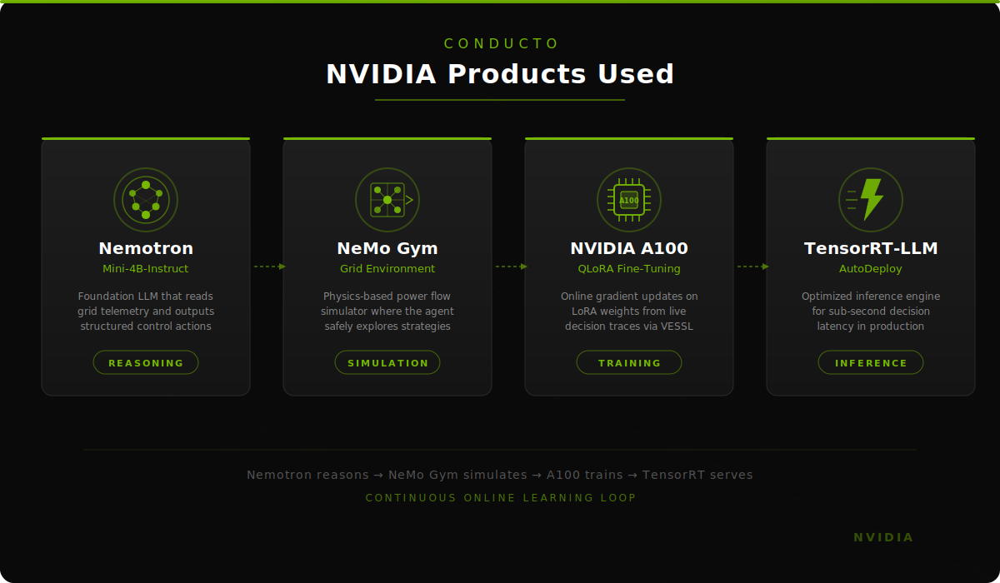
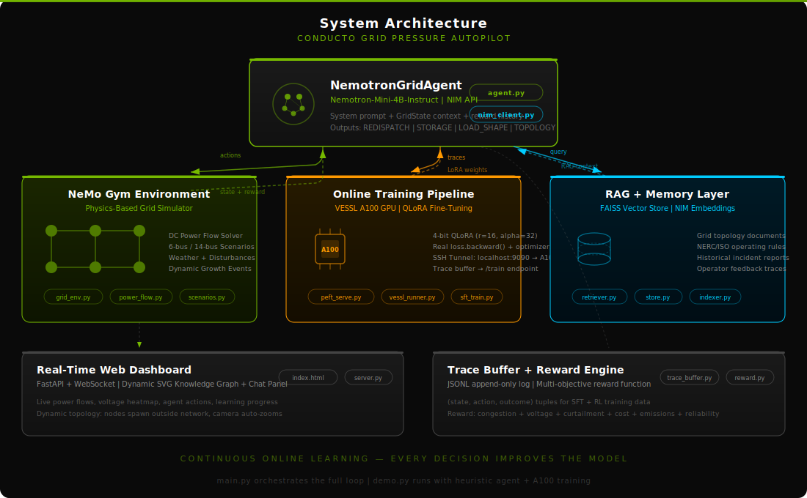
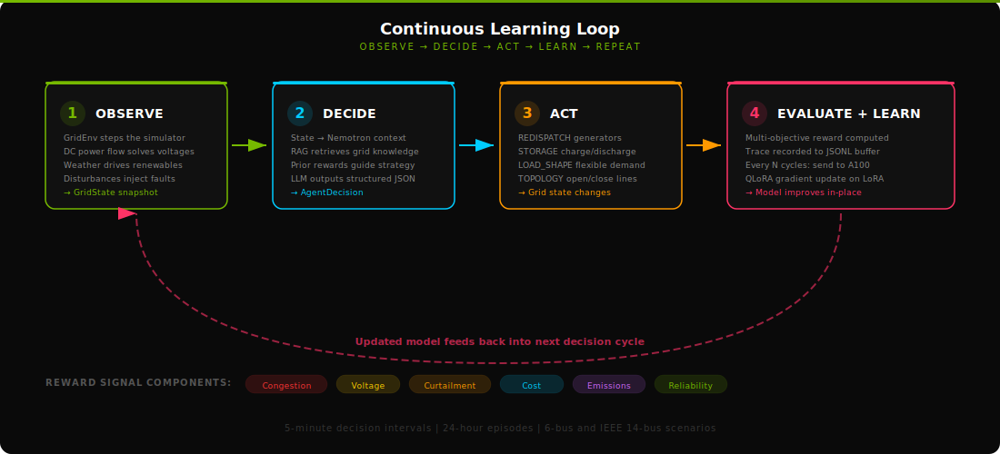

# Conducto: NVIDIA-native Power Grid Power Management Autopilot

A Nemotron-based agent that continuously learns to manage power grid congestion, voltage violations, and renewable curtailment — trained online on NVIDIA A100 GPUs while it operates.

Demo Video: https://youtu.be/nbLHjGUXToU

> *If viewing locally, open `demo-vid.mp4` in the project root.*


---

## The Problem

High renewables, EV charging, and data center load create rapid, localized surges on transmission lines and transformers. Traditional grid operations rely on slow planning tools and fixed rules — they can't re-optimize fast enough as weather, demand, and asset status change minute-by-minute.

This lag leads to preventable blackouts, over-stressed lines, and wasted renewable energy, even though the system has flexibility (batteries, EVs, flexible loads) that could be steered in real time.

**Conducto's thesis:** we need an always-learning control brain that observes the grid, tests policies in a digital twin, and updates its behavior continuously — *while it's live on the system* — instead of the "train offline, deploy, hope it generalizes" loop utilities use today.

---

## NVIDIA Products Used

<div align="center">
  
</div>

| Product | Role | How It's Used |
|---------|------|---------------|
| **Nemotron-Mini-4B-Instruct** | Reasoning | Foundation LLM that reads grid telemetry and outputs structured JSON control actions (redispatch, storage, topology, load shaping) |
| **NeMo Gym** | Simulation | Physics-based power flow environment where the agent safely explores strategies before they touch real infrastructure |
| **NVIDIA A100 GPU** | Training | Online QLoRA fine-tuning (r=16, alpha=32) with real `loss.backward()` + `optimizer.step()` on live decision traces via VESSL |
| **TensorRT-LLM** | Inference | AutoDeploy compiles the fine-tuned Nemotron into an optimized inference graph for sub-second decision latency in production |

---

## Architecture

<div align="center">
  
</div>

### Core Components

```
conducto/
├── main.py                          # Full control loop: LLM agent + physics sim + A100 training
├── demo.py                          # Heuristic agent + A100 training (fast demo mode)
│
├── nemotron_agent/
│   ├── agent.py                     # NemotronGridAgent — decide() loop with NIM API
│   ├── nim_client.py                # NVIDIA NIM REST client (cloud or self-hosted)
│   ├── config.py                    # Environment config (.env loading)
│   ├── grid_state.py                # GridState — structured observation for LLM context
│   ├── trace_buffer.py              # JSONL append-only trace log for training data
│   │
│   ├── gym/
│   │   ├── grid_env.py              # Gymnasium-compatible GridEnv with growth mechanics
│   │   ├── power_flow.py            # DC power flow solver (B-matrix, voltage angles)
│   │   ├── scenarios.py             # 6-bus and IEEE 14-bus grid topologies
│   │   └── reward.py                # Multi-objective reward function
│   │
│   └── training/
│       ├── vessl_runner.py          # SSH into VESSL A100, deploy model, open tunnel
│       ├── scripts/
│       │   ├── peft_serve.py        # FastAPI server ON the A100 (inference + /train endpoint)
│       │   ├── sft_train.py         # Supervised fine-tuning script
│       │   └── rl_train.py          # RL fine-tuning script
│       ├── vessl_sft.yaml           # VESSL Run config for SFT jobs
│       └── vessl_dpo.yaml           # VESSL Run config for DPO jobs
│
├── inference_engine/
│   ├── deploy_vessl.py              # End-to-end: merge LoRA → build TRT-LLM → serve
│   ├── merge_adapters.py            # Merge LoRA adapters into base Nemotron
│   └── vessl_serve.py               # Manage inference server on VESSL (start/stop/logs)
│
├── memory/
│   ├── rag/
│   │   ├── store.py                 # FAISS vector store with NIM embeddings
│   │   ├── retriever.py             # Retrieves grid knowledge for agent context
│   │   └── indexer.py               # Indexes topology, procedures, incidents
│   └── copilot/
│       ├── feedback.py              # Operator approve/reject → training labels
│       └── server.py                # Co-pilot dashboard server
│
├── data/features/
│   ├── state_builder.py             # Builds structured state vectors for Nemotron
│   └── summarizer.py                # Human-readable grid summaries for LLM context
│
├── frontend/
│   ├── server.py                    # FastAPI + WebSocket broadcast server
│   └── static/index.html            # Real-time SVG knowledge graph + chat dashboard
│
├── adapters/v1/                     # Trained LoRA adapter checkpoints
└── assets/                          # Diagrams and media
```

---

## How It Works

<div align="center">
  
</div>

### The Continuous Learning Loop

Every 5 minutes (configurable), Conducto runs a complete decision cycle:

**1. Observe** — The `GridEnv` steps the physics simulator. A DC power flow solver computes bus voltages, line flows, and loading percentages. Weather drives renewable output. Disturbances inject faults (line trips, load spikes, generator outages). The result is a `GridState` snapshot.

**2. Decide** — The grid state is serialized into Nemotron's context window alongside RAG-retrieved grid knowledge (topology docs, NERC rules, past incidents) and reward feedback from prior cycles. Nemotron outputs a structured JSON decision:

```json
{
  "assessment": "LN01 congested at 94%, B4-SUBURB voltage low at 0.92 pu",
  "risk_level": "high",
  "actions": [
    {"type": "REDISPATCH", "target": "B2-GAS", "params": {"target_mw": 150}, "reason": "Reduce flow on LN01"},
    {"type": "STORAGE", "target": "BESS-SUBURB", "params": {"setpoint_mw": -30}, "reason": "Discharge to support B4 voltage"},
    {"type": "LOAD_SHAPE", "target": "B1-CITY", "params": {"delta_mw": -15}, "reason": "Shed flexible load during peak"}
  ]
}
```

**3. Act** — Actions are translated into physics: generator setpoints change, batteries charge/discharge, flexible loads shift, switches open/close. The power flow re-solves with the new parameters.

**4. Evaluate + Learn** — A multi-objective reward function scores the result across six dimensions:

| Signal | Weight | What It Measures |
|--------|--------|------------------|
| Congestion | 5.0 | Line loading above 100% thermal rating |
| Voltage | 3.0 | Bus voltages outside 0.95–1.05 pu |
| Curtailment | 2.0 | Wasted renewable generation |
| Imbalance | 4.0 | Generation-load mismatch |
| Cost | 0.5 | Total generation operating cost |
| Emissions | 1.0 | Carbon intensity of dispatch |
| Reliability | 10.0 | All load served, no islands |

The (state, action, reward) trace is logged to a JSONL buffer. Every N cycles, accumulated traces are sent to the VESSL A100 where `peft_serve.py` runs a real gradient update on the LoRA weights — the model improves in-place without restart.

---

## Grid Scenarios

### 6-Bus Renewable Grid

```
[SOLAR] B0 ──LN01── B1 [CITY-LOAD] ──LN12── B2 [GAS-GEN]
         │               │                        │
       LN03            LN14                     LN25
         │               │                        │
[WIND] B3 ──LN34── B4 [SUBURB+BESS] ──LN45── B5 [COAL-GEN,SLACK]
```

- 6 buses, 7 branches, 1 battery (100 MWh at B4)
- Solar (B0) and wind (B3) renewable generation
- Gas (B2) and coal (B5) dispatchable generation
- Heavy city (B1: 210 MW) and suburb (B4: 130 MW) loads
- 7 disturbances over 24 hours: line trips, load spikes, restorations

### IEEE 14-Bus with DERs

- Standard IEEE 14-bus topology augmented with distributed energy resources
- Solar at buses 2, 6, 8; Wind at bus 3
- 2 batteries: BESS-09 (80 MWh) and BESS-14 (40 MWh)
- 20 branches, 14 buses, 4 disturbances including generator outage

### Dynamic Growth

The grid grows during operation — new buses and branches spawn at the network edge every ~35 seconds. The SVG dashboard auto-zooms to accommodate topology changes in real time.

---

## Real-Time Dashboard

The web frontend renders a live SVG knowledge graph of the power grid with a chat panel showing the agent's thinking and actions.

### Visual Encoding

**Node (Bus) Colors** — voltage health:
- **Green** (0.97–1.03 pu) — Healthy
- **Yellow** (0.95–0.97 or 1.03–1.05 pu) — Warning
- **Red** (< 0.95 or > 1.05 pu) — Violation

**Line (Branch) Colors** — power flow loading:
- **Dark gray** (< 50%) — Lightly loaded
- **Green** (50–80%) — Moderate
- **Yellow** (80–95%) — High
- **Red** (> 95%) — Congested
- **Dashed + blinking** — Tripped/disconnected

**Action Highlights:**
- Orange pulse — REDISPATCH targeting a bus
- Green pulse — STORAGE action
- Cyan pulse — LOAD_SHAPE action
- Cyan dashed line — TOPOLOGY action

---

## Online Training on VESSL A100

The training pipeline runs **on the GPU**, not locally. Here's how it works:

```
Your Mac                          VESSL A100 Workspace
─────────                         ────────────────────
demo.py / main.py                 peft_serve.py
  │                                 │
  ├─ Collects decision traces       ├─ Loads Nemotron-Mini-4B (4-bit QLoRA)
  ├─ Every N cycles: POST /train ──→├─ Receives traces
  │   (via SSH tunnel)              ├─ Builds SFT prompt/completion pairs
  │                                 ├─ loss.backward() + optimizer.step()
  │                                 ├─ LoRA weights updated in-place
  └─ Reads updated inference ←──────└─ Serves /v1/chat/completions
```

### LoRA Configuration

```json
{
  "peft_type": "LORA",
  "base_model": "nvidia/Nemotron-Mini-4B-Instruct",
  "r": 16,
  "lora_alpha": 32,
  "lora_dropout": 0.05,
  "target_modules": ["q_proj", "k_proj", "v_proj", "o_proj"],
  "task_type": "CAUSAL_LM"
}
```

Trained adapter checkpoints are saved in `adapters/v1/` with full checkpoint history.

---

## Quick Start

### Prerequisites

- Python 3.12+
- NVIDIA API key (for NIM cloud inference)
- VESSL AI workspace with A100 GPU (for online training)

### 1. Install dependencies

```bash
pip install requests python-dotenv numpy gymnasium websockets uvicorn fastapi
```

### 2. Configure environment

Create `nemotron_agent/.env`:

```env
NVIDIA_API_KEY=nvapi-your-key-here
VESSL_SSH_HOST=root@your-workspace.cloud.vessl.ai
VESSL_SSH_PORT=22
VESSL_SSH_KEY_PATH=./your-key.pem
```

### 3. Run the demo

```bash
# Heuristic agent + A100 online training + web dashboard
python demo.py --fast --web

# Full LLM agent loop (requires NIM API key)
python main.py --fast --web

# Specify scenario
python main.py --scenario 14-bus --cycles 50
```

### 4. Open the dashboard

Navigate to [http://localhost:8080](http://localhost:8080) to see the live grid visualization.

### 5. Deploy to production (TensorRT-LLM)

```bash
# Merge LoRA adapters → build TRT-LLM engine → start inference server
python inference_engine/deploy_vessl.py \
    --adapter_path ./adapters/v1 \
    --quantization fp8

# Or manage the server directly
python inference_engine/vessl_serve.py start
python inference_engine/vessl_serve.py status
python inference_engine/vessl_serve.py health
```

---

## RAG Knowledge Layer

Conducto retrieves relevant grid knowledge into Nemotron's context at each decision:

- **Topology** — Bus specs, line thermal ratings, transformer data
- **Procedures** — NERC/ISO reliability standards, operating rules
- **Incidents** — Historical outage reports, root causes, resolutions

Backed by a FAISS vector store with NVIDIA NIM embeddings (`nvidia/nv-embedqa-e5-v5`). Documents are chunked, embedded, and indexed by the `GridDocIndexer`. At decision time, the `GridRetriever` formulates queries from current grid conditions (congested lines, voltage violations, alerts) and injects the top results into the agent's context window.

---

## Operator Co-Pilot

The feedback loop includes human oversight:

1. Agent proposes actions through the dashboard
2. Operator can **approve**, **reject**, or **modify** recommendations
3. Feedback is recorded as training labels:
   - Approved decisions → positive SFT examples
   - Rejected decisions → negative examples for DPO training
4. Next fine-tuning round incorporates operator preferences

This creates a flywheel: the model improves from both physics rewards *and* human expertise.

---

## Key Design Decisions

| Decision | Rationale |
|----------|-----------|
| DC power flow (not AC) | Fast enough for 5-minute real-time cycles; captures congestion and voltage trends |
| QLoRA (not full fine-tuning) | Fits on a single A100; trains in seconds per batch; LoRA weights hot-swap without restart |
| Structured JSON actions | Deterministic parsing; each action maps directly to a physics parameter |
| Multi-objective reward | Grid operations balance competing concerns — cost vs. reliability vs. emissions |
| Append-only trace buffer | Training data accumulates without data loss; supports replay and filtering |
| SSH tunnel to VESSL | Simple, secure; no public endpoints required for the training server |

---

<div align="center">

Built with NVIDIA Nemotron, NeMo Gym, A100, and TensorRT-LLM

</div>
